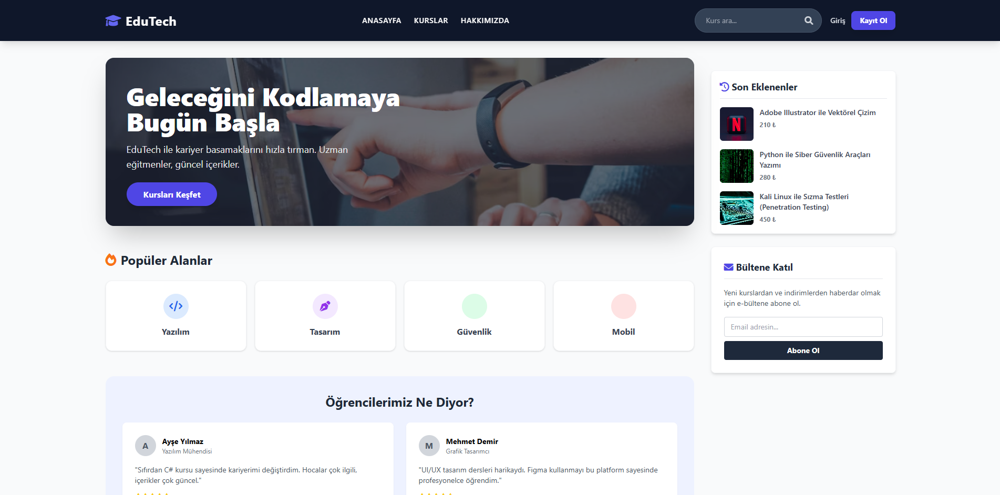
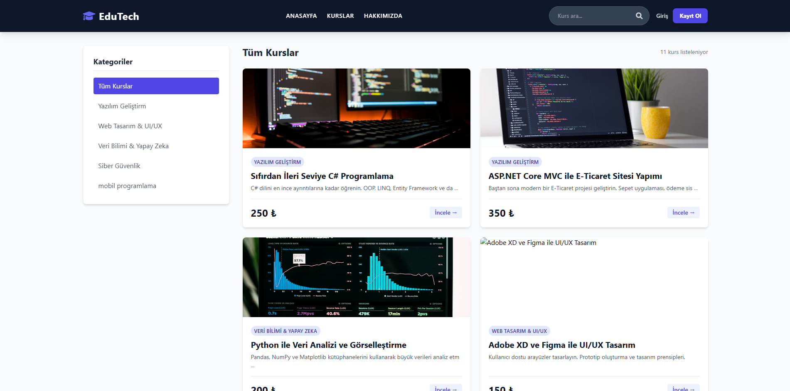
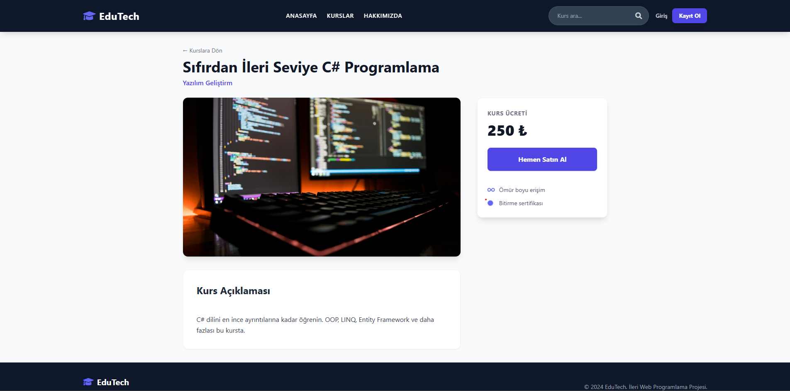

# EduTech - Eğitim Platformu


ASP.NET Core MVC ile geliştirilmiş modern bir eğitim platformu. Kurs yönetimi, kullanıcı yönetimi ve satış işlemlerini içeren kapsamlı bir e-öğrenme sistemidir.

## 📋 Proje Hakkında

EduTech, öğrencilerin kursları keşfedebildiği, satın alabildiği ve yöneticilerin kurs ile kategori yönetimi gerçekleştirebildiği profesyonel bir web uygulamasıdır. Proje, ASP.NET Core MVC mimarisi ve modern web teknolojileri kullanılarak geliştirilmiştir.

## 🛠️ Teknolojiler

- **.NET 8.0** - Framework ve runtime
- **ASP.NET Core MVC** - Web uygulama framework'ü
- **Entity Framework Core 8.x** - ORM ve veritabanı erişim katmanı
- **SQL Server** - İlişkisel veritabanı yönetim sistemi
- **Tailwind CSS** - Utility-first CSS framework
- **jQuery** - JavaScript kütüphanesi

## 📸 Ekran Görüntüleri

### Ana Sayfa


### Kurs Listesi


### Kurs Detay



## 🏗️ Proje Yapısı

```
EduTech/
├── Controllers/          # Controller sınıfları
│   ├── AuthController.cs
│   ├── CategoryController.cs
│   ├── CourseController.cs
│   ├── HomeController.cs
│   └── StudentController.cs
├── Models/              # Veri modelleri
│   ├── Category.cs
│   ├── Course.cs
│   ├── Sale.cs
│   └── User.cs
├── Data/                # Veritabanı bağlamı
│   └── AppDbContext.cs
├── Views/               # Razor view dosyaları
│   ├── Auth/
│   ├── Category/
│   ├── Course/
│   ├── Home/
│   └── Student/
├── ViewComponents/      # View component'ler
└── Migrations/          # Entity Framework migrations
```

## ✨ Özellikler

### Kullanıcı Yönetimi
- Kullanıcı kayıt ve giriş sistemi
- Rol tabanlı yetkilendirme (Admin/Student)
- Session tabanlı oturum yönetimi

### Kurs Yönetimi
- Kurs listeleme ve detay görüntüleme
- Kategori bazlı filtreleme
- Gelişmiş kurs arama özelliği
- Kurs oluşturma, düzenleme ve silme (Admin yetkisi)
- Kurs satın alma işlemi

### Kategori Yönetimi
- Kategori listeleme
- Kategori oluşturma ve düzenleme (Admin yetkisi)

### Öğrenci Paneli
- Satın alınan kursları görüntüleme
- Kullanıcı profil yönetimi

## 🚀 Kurulum

### Gereksinimler
- .NET 8.0 SDK veya üzeri
- SQL Server (veya SQL Server Express)
- Visual Studio 2022 veya Visual Studio Code
- Entity Framework Core Tools

### Adımlar

1. **Projeyi klonlayın veya indirin:**
```bash
git clone https://github.com/OmerEbubekir/Ileri_Web_Projesi.git
cd EduTech
```

2. **Veritabanı bağlantı string'ini yapılandırın:**
   - `EduTech/appsettings.json` dosyasındaki `ConnectionStrings` bölümünü düzenleyin
   - SQL Server bağlantı bilgilerinizi girin

3. **Migration'ları çalıştırın:**
```bash
cd EduTech
dotnet ef database update
```

4. **Projeyi çalıştırın:**
```bash
dotnet run
```

5. **Tarayıcıda uygulamayı açın:**
   - `https://localhost:5001` veya konsolda gösterilen URL'yi kullanın

## 🔐 Test Hesapları

Uygulamayı test etmek için aşağıdaki hesapları kullanabilirsiniz:

| Rol | E-posta | Şifre |
|-----|---------|-------|
| **Admin** | admin@edutech.com | 123 |
| **Öğrenci** | student@edutech.com | 123 |

> **Güvenlik Uyarısı:** Bu hesaplar yalnızca geliştirme ve test amaçlıdır. Üretim ortamında mutlaka güçlü şifreler kullanın.

## 📝 Veritabanı Modelleri

- **User**: Kullanıcı bilgileri (Id, FullName, Email, Password, Role)
- **Category**: Kurs kategorileri (Id, Name)
- **Course**: Kurs bilgileri (Id, Title, Description, ImageUrl, Price, CategoryId)
- **Sale**: Satış kayıtları (Id, UserId, CourseId, Price, Date)

## 🔐 Varsayılan Roller

- **Admin**: Kurs ve kategori yönetimi yapabilir, tüm CRUD işlemlerini gerçekleştirebilir
- **Student**: Kursları görüntüleyebilir, arama yapabilir ve kurs satın alabilir

## 📚 Kullanılan Mimari Desenler

- **MVC (Model-View-Controller)**: Uygulama mimarisi ve katmanlı yapı
- **Dependency Injection**: Bağımlılık yönetimi ve gevşek bağlılık
- **Session Management**: Kullanıcı oturum yönetimi ve state yönetimi

## 🎯 Proje Amaçları

Bu proje, aşağıdaki konuların öğrenilmesi ve uygulanması amacıyla geliştirilmiştir:

- ASP.NET Core MVC temelleri ve best practices
- Entity Framework Core ile veritabanı işlemleri
- CRUD (Create, Read, Update, Delete) operasyonları
- Authentication ve Authorization mekanizmaları
- View Components kullanımı ve yeniden kullanılabilir bileşenler
- Razor View Engine ve dinamik içerik oluşturma
- Session yönetimi ve state tutma

## 📄 Lisans

Bu proje eğitim amaçlı geliştirilmiştir.
